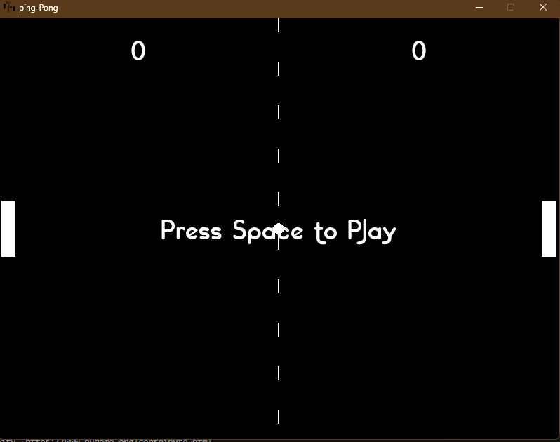

# Pygame Pong

A classic two-player Pong game built with Python and the Pygame library. This project features dynamic ball physics, sound effects, and a simple, clean interface.


 &nbsp;&nbsp;  &nbsp;&nbsp; 


## Features

-   **Two-Player Local Game**: Compete against a friend on the same keyboard.
-   **Dynamic Ball Physics**: The ball's reflection angle changes based on where it hits the paddle.
-   **Sound Effects**: Includes sounds for paddle hits and scoring points.
-   **Scoring System**: The first player to reach 10 points wins the match.
-   **Start Screen**: A "Press Space to Play" message waits for the players to be ready.
-   **Dynamic Ball Color**: The ball changes to a random color every time it's hit.

## Installation & Setup

To run this game on your local machine, follow these steps.

**1. Clone the repository:**

```bash
git clone [https://github.com/your-username/your-repo-name.git](https://github.com/your-username/your-repo-name.git)
cd your-repo-name
```

**2. Create a virtual environment (recommended):**

```bash
# For Windows
python -m venv venv
venv\Scripts\activate

# For macOS/Linux
python3 -m venv venv
source venv/bin/activate
```

**3. Install dependencies:**
The only dependency is Pygame, which is listed in the `requirements.txt` file.

```bash
pip install -r requirements.txt
```

**4. Run the game:**

```bash
python runner.py
```

## How to Play

-   **Start Game**: Press the **SPACEBAR** to serve the ball.
-   **Player 1 (Left Paddle)**:
    -   **W Key**: Move Up
    -   **S Key**: Move Down
-   **Player 2 (Right Paddle)**:
    -   **Up Arrow**: Move Up
    -   **Down Arrow**: Move Down

The first player to score **10 points** wins! The game will then reset.

## Project Structure

This project is split into two main Python files, separating game logic from the main game loop. The `data` folder must be in the same directory as the Python files.

```
.
├── runner.py         # Main game loop, handles events and game state
├── pong.py           # Contains all game classes (Ball, Paddle) and logic functions
├── data/
│   ├── font/
│   │   └── chilispepper.ttf
│   ├── images/
│   │   └── icon/
│   │       └── ping-pong.png
│   └── sounds/
│       ├── Bounce.wav
│       └── score.wav
├── requirements.txt  # Python dependencies
└── README.md         # This file
```
